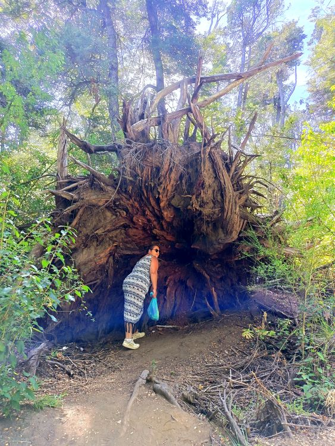
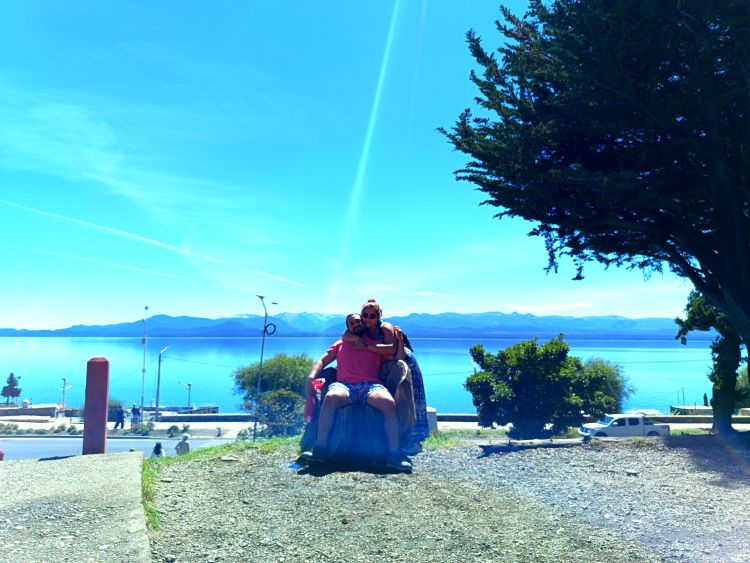
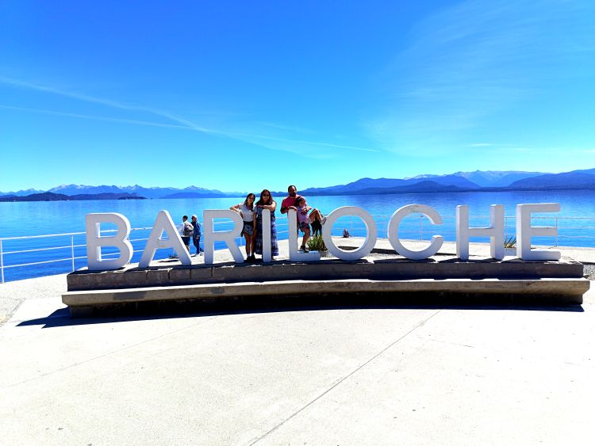
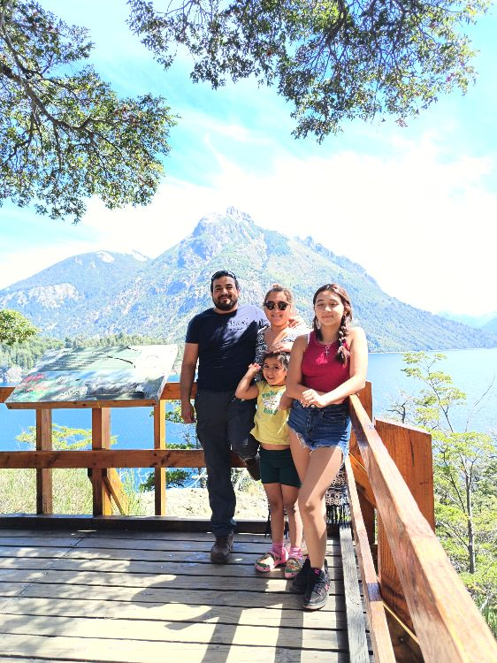
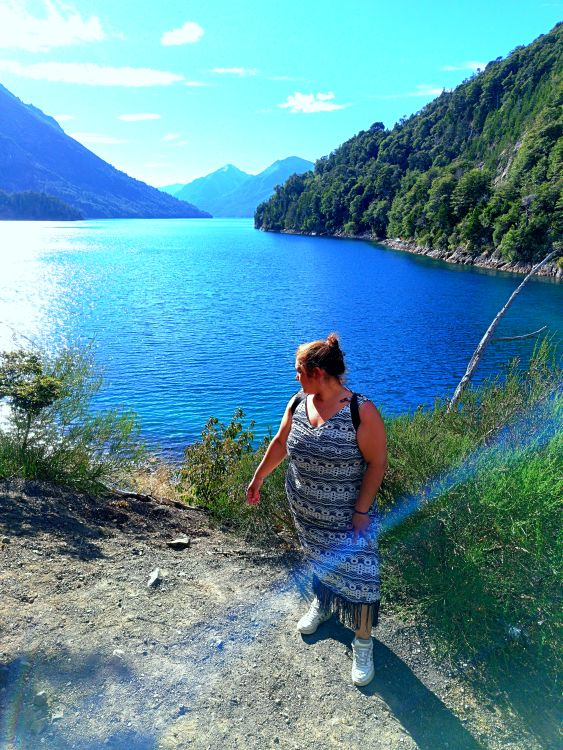
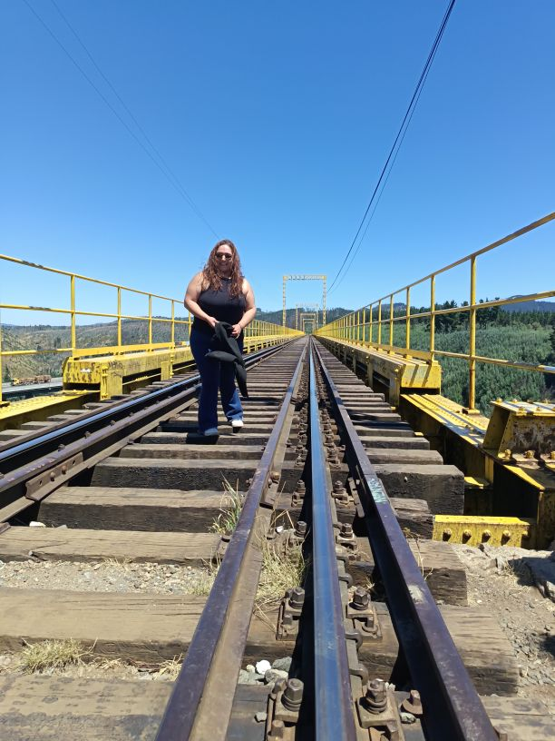

[recuerdos.html](https://github.com/user-attachments/files/27561987/recuerdos.html)
<!DOCTYPE html>
<html lang="es">
<head>
  <meta charset="UTF-8" />
  <meta name="viewport" content="width=device-width, initial-scale=1.0" />
  <title>Recuerdos premium para Alejandra</title>
  <link rel="preconnect" href="https://fonts.googleapis.com">
  <link rel="preconnect" href="https://fonts.gstatic.com" crossorigin>
  <link href="https://fonts.googleapis.com/css2?family=Cormorant+Garamond:wght@400;500;600;700&family=Great+Vibes&family=Playfair+Display:wght@500;600;700&display=swap" rel="stylesheet">
  
</head>
<body>
  

  

    <header class="hero">
      
Recuerdos con amor

      <h1>Para Alejandra Moscoso Garate</h1>
      
Ahora con mucho mas corazones y recuerdos giratorios, cada aventura con una dedicatoria especial escrita. No te olvides de colocar PLAY A LA CANCIÓN

    </header>

    <section class="panel music-card">
      

        

          <svg width="24" height="24" viewBox="0 0 24 24" fill="none" stroke="currentColor" stroke-width="1.8" stroke-linecap="round" stroke-linejoin="round">
            <path d="M16 9a4 4 0 0 1-8 0"/><path d="M12 5c3 0 6 2 6 5v6a2 2 0 0 1-2 2H8a2 2 0 0 1-2-2v-6c0-3 3-5 6-5Z"/><path d="M9 14h.01M15 14h.01"/>
          </svg>
        

        

          <h2>La mamá que elegí para mis hijos</h2>
          
Canción integrada en este recuerdo

        

        
Auto

      

      

        
La canción acompaña cada imagen y cada palabra dedicada para ti.

        <audio controls autoplay loop preload="auto">
          <source src="./La-mama-que-elegi-para-mis-hijos.mp3" type="audio/mpeg">
          Tu navegador no soporta audio HTML.
        </audio>
      

    </section>

    <section class="panel intro">
      <h3>Postales</h3>
      
No olvides presionar cada imagen para girarla mi amorcito. La parte de atrás tiene una delicada leyenda para ti Alejandra Moscoso Garate.

    </section>

    <section class="cards">
      <article class="memory-card"><button class="memory-btn" type="button" aria-label="Girar recuerdo de Bariloche">

<h4>Bariloche</h4>
A tu lado cada viaje se vuelve inolvidable, porque en cada paisaje lo más hermoso siempre termina siendo tu presencia y tu manera de llenar todo de amor.

C.A.I.S

</button></article>
      <article class="memory-card"><button class="memory-btn" type="button" aria-label="Girar recuerdo frente al lago">

<h4>Tu abrazo</h4>
En tus brazos encuentro calma y hogar. Cada instante contigo se queda guardado en mi corazón como uno de los recuerdos más bonitos de mi vida.

C.A.I.S

</button></article>
      <article class="memory-card"><button class="memory-btn" type="button" aria-label="Girar recuerdo en el bosque">

<h4>Mi amor</h4>
Eres fuerza, ternura y belleza en una sola alma. Cada recuerdo contigo se vuelve un tesoro y cada día a tu lado confirma cuánto te amo, Alejandra.

C.A.I.S

</button></article>
      <article class="memory-card"><button class="memory-btn" type="button" aria-label="Girar recuerdo en el puente">

<h4>Contigo</h4>
Caminar contigo incluso sobre los caminos más largos se siente fácil, porque tu compañía convierte cualquier trayecto en algo seguro, bonito y especial.

C.A.I.S

</button></article>
      <article class="memory-card"><button class="memory-btn" type="button" aria-label="Girar recuerdo junto al lago azul">

<h4>Tu esencia</h4>
Hay una paz en ti que se parece a estos paisajes: serena, inmensa y hermosa. Por eso estar contigo siempre se siente como respirar amor con calma.

C.A.I.S

</button></article>
      <article class="memory-card"><button class="memory-btn" type="button" aria-label="Girar recuerdo familiar en mirador">

<h4>Nuestra familia</h4>
Verte junto a quienes amas me recuerda lo afortunado que soy. Eres el corazón de esta historia, el abrazo que une y la luz más bonita de nuestro hogar.

C.A.I.S

</button></article>
    </section>

    
Si la música no inicia sola, toca el reproductor una vez. Después puedes girar cada postal para leer su mensaje.

  

  
</body>
</html>
[La-mama-que-elegi-para-mis-hijos.mp3](https://github.com/user-attachments/files/27561989/La-mama-que-elegi-para-mis-hijos.mp3)
